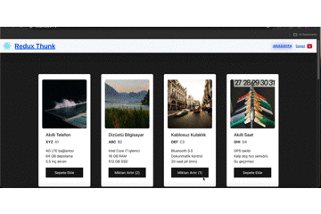

<h1>REACT THUNK E COMMERCE APP</h1>

 This project is an ecommerce project created using react thunk. Within the project, an API request is sent with the json data we have created and the products are listed on the home page. Products are added to a basket and the quantity of the product in the basket is changed with the + and - buttons. In this way, the total basket amount is also calculated.  

